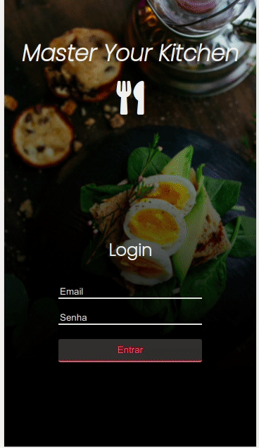
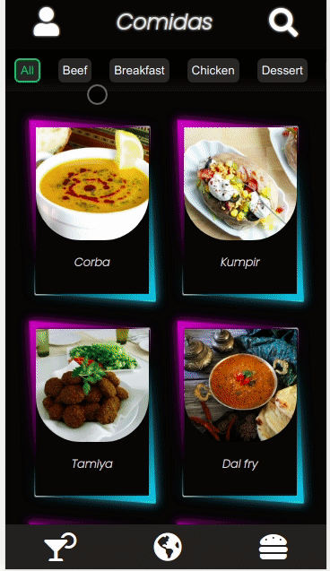
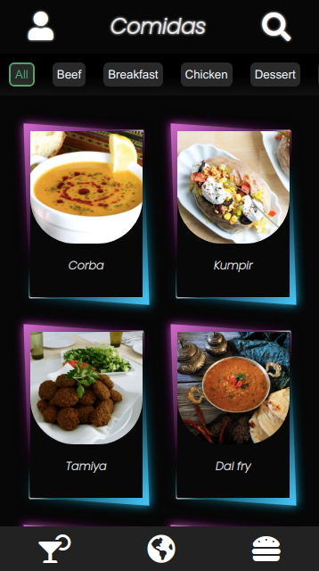
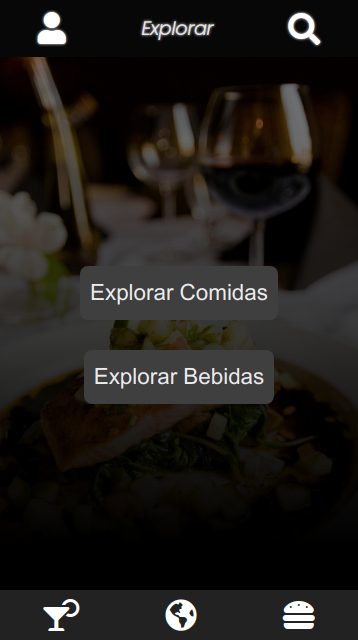
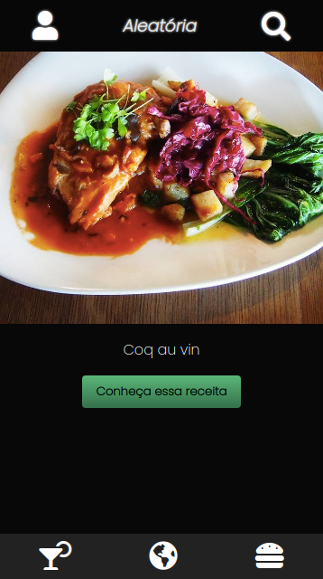
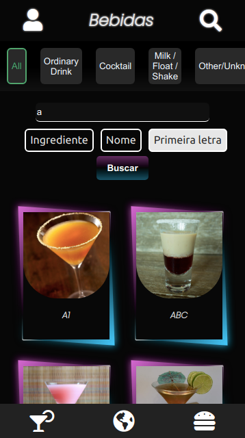

<h1 align="center">Recipes App</h1>
 

# :pushpin: Index
- [Project Media](#camera_flash-project-media)
- [About](#monocle_face-about)
- [Technologies](#rocket-tecnologias-usadas)
- [Authors](#closed_book-authors)
 

---
# :camera_flash: Project Media

 

---
# :monocle_face: About
This project was developed in order to practice ReactJS features in the format of a mobile application. The development happened together, using agile methods.

A recipe API was consumed to develop the application.
You can search for recipes by name, first letter or ingredient.
You can also add a recipe to favorites so that it is saved in the Local Storage.
 

---

# :rocket:  Technologies
This project was developed with the following technologies:  
- :heavy_check_mark: **HTML**
- :heavy_check_mark: **CSS**
- :heavy_check_mark: **JavaScript**
- :heavy_check_mark: **ReactJS**
- :heavy_check_mark: **React Hooks**
- :heavy_check_mark: **Context API**
  
 

---

# :closed_book: Authors
By Patrick Morais.
### :link: LinkedIn: https://www.linkedin.com/in/patrick-morais/

By [Edmilson Bernardo](https://github.com/EdmilsonBernardo).
### :link: LinkedIn: https://www.linkedin.com/in/edmilsonbernardont/
